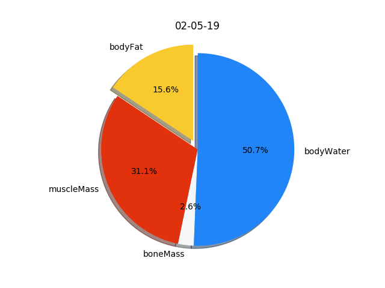
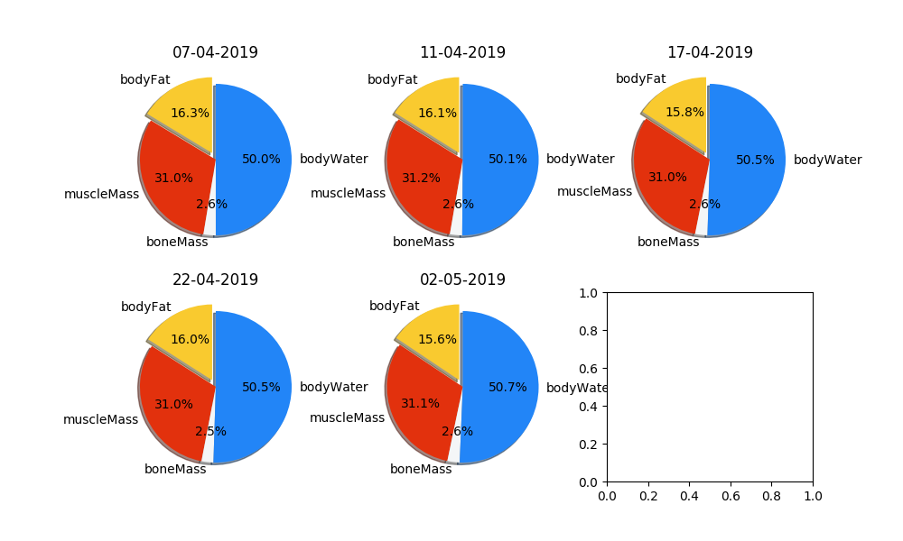
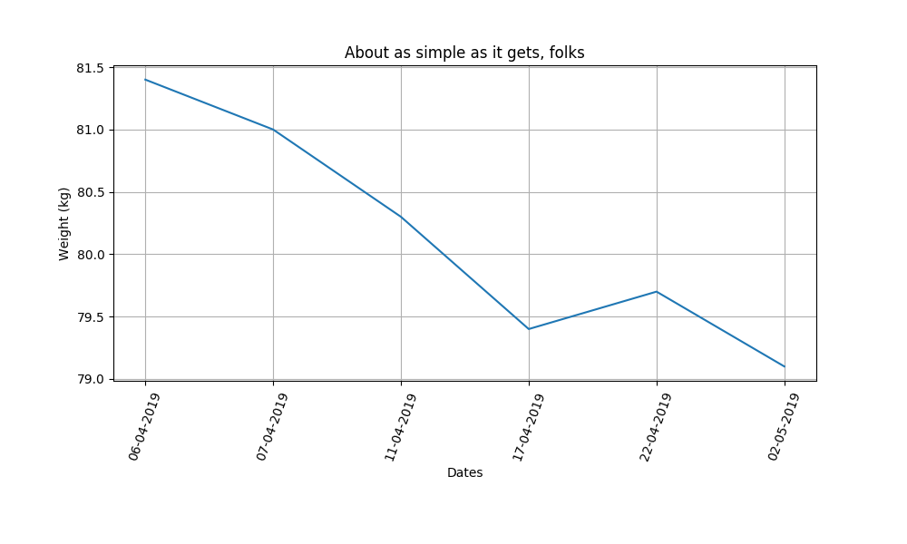
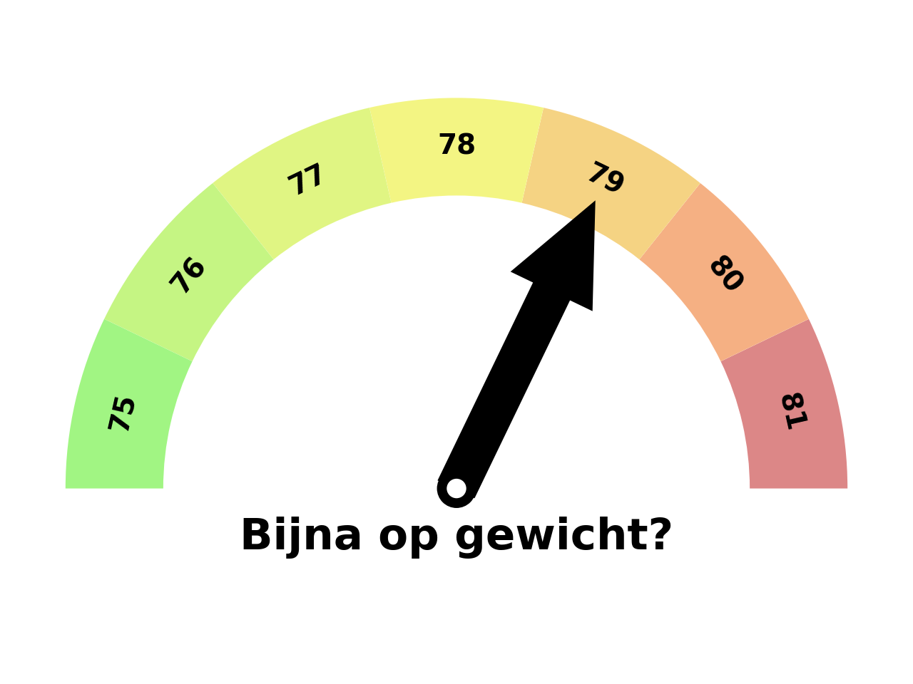
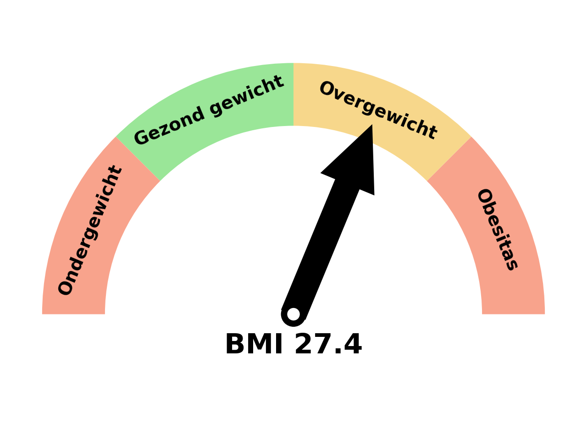

So the data from Medisana (like in the [data link]({{ site.baseurl }}/data)) can be easily put to nice graphs with the matplotlib library.

{: .box-error}
**Error:** Looking at my data can cause instant weightloss.

> Just kidding

First load the library in your python script.

```python
import matplotlib.pyplot as plt
```

and load some other stuff for processing and layout reasons (like showing dates)

```python
import os
import json
from datetime import date, datetime
```

And then you can start using it!

Just don't forget to run the medisana.py before you run this script!

### loading the json file

You can easily grab the last json file by


    def __init__(self):
        self.datum = '{:%d-%b-%Y}'.format(date.today())

        dir_path = os.path.dirname(os.path.realpath(__file__))
        folder = os.path.join(dir_path, "data")
        data_file_name = "{}_weights.json".format(self.datum)
        self.data_file = os.path.join(folder, data_file_name)

        with open(self.data_file, 'r') as json_file:
            self.weight_data = json.load(json_file)


So now you have the json data in the var weight_data.


### Pie chart current data

So lets get the current situation (last weighting) into a nice pie graph.


Its actually very easy to create this pie chart.

Just put the labels in, then get the sizes from the self.weight_data variable put it together with a nice title. And voila!


    def mathlib_pie_chart(self):
        labels = 'bodyFat','muscleMass','boneMass','bodyWater'
        colors = ['#f9ca2f', '#e2310d', '#f4f6f7', '#2285f7']
        sizes = [self.weight_data['lastval_bodyFat'], 
                  self.weight_data['lastval_muscleMass'], 
                  self.weight_data['lastval_boneMass'], 
                  self.weight_data['lastval_bodyWater']]
        explode = (0.1, 0, 0, 0)

        fig1, ax1 = plt.subplots()
        ax1.pie(sizes, explode=explode, labels=labels, autopct='%1.1f%%',
                colors=colors, shadow=True, startangle=90)
        ax1.axis('equal')  # Equal aspect ratio ensures that pie is drawn as a circle.
        plt.title(self.weight_data['lastMeasurementDate'])
        plt.savefig('images/pie-chart.png')


## Pie charts last 6 measurements

Showing in a Pie what the measurements of water, fat, bones and muscle is, is in my opinion a much better way than stacked bars.

And what is even better than showing a pie chart? Yes! Showing mutiple pie charts.




    def mathlib_pie_charts(self):
        labels = 'bodyFat','muscleMass','boneMass','bodyWater'
        colors = ['#f9ca2f', '#e2310d', '#f4f6f7', '#2285f7']
        explode = (0.1, 0, 0, 0)  # only "explode" the 1nd slice (i.e. 'Fat')
        
        fig, axes = plt.subplots(2, 3, figsize=(10, 6))
        
        i = 0
        data = self.weight_data['bodyWeight']
        for w in data[-5:]:
            if w['x'] < self.first_date:
                continue
            
            sizes = [w['bodyFat'], w['muscleMass'], w['boneMass'], w['bodyWater']]
  
            ax = axes[i // 3, i % 3]
            ax.pie(sizes, explode=explode, labels=labels, colors=colors, autopct='%1.1f%%',
                   shadow=True, startangle=90)

            ts = int(str(w['x'])[:-3])
            date = datetime.utcfromtimestamp(ts).strftime('%d-%m-%Y')
            ax.set_title(date)
            i += 1
        fig.subplots_adjust(wspace=.2)
        filename = os.path.join(self.image_folder, "pie-charts.png")
        plt.savefig(filename)


## Line chart from certain date

So I've been using my Medisana Scale since 2015. But I do not want to show all the data from that point. As it will become an unreadable chart.

So I use the data I want to show from a certain date. Unixtimestamp to be clear.

The `self.first_date` is a unix timestamp set on init and can be used throughout the script.




    def basic_Line_chart(self, all=None):
        # Data for plotting
        dates = []
        values = []
        data = self.weight_data['bodyWeight']
        i = 0
        for w in data:
            if all is not None:
                if w['x'] < self.first_date:
                    continue

            ts = int(str(w['x'])[:-3])
            if i == 0:
                month_year = datetime.utcfromtimestamp(ts).strftime('%m-%Y')
                i = 1

            date = datetime.utcfromtimestamp(ts).strftime('%d-%m-%Y')
            dates.append(date)
            values.append(w['y'])

        fig = plt.figure(figsize=(10, 6))
        ax = fig.add_subplot(111)
        plt.xticks(rotation=70)
        plt.subplots_adjust(hspace=0, bottom=0.3)
        ax.plot(dates, values)

        ax.set(xlabel='Dates', ylabel='Weight (kg)',
               title='About as simple as it gets, folks')

        ax.grid()

        filename = os.path.join(self.image_folder, "linechart_{}.png".format(month_year))
        plt.savefig(filename)


## Weight Gauge

So you can show your weight in a bar or line chart. But it might be nicer to show where you came from and where you want to go.

That is why I'm using a Guage with 75 as my target and 81 where I came from.



I found this Gauge creation script on internet and I created my own [class out](https://gist.github.com/tvdsluijs/5c64845a67df6288126de624dcc22756) of it.


    def create_gauge(self):

        g = Gauge()
        # myLabels = ['75', '76', '77', '78', '79', '80', '81']
        my_labels = list(range(75, 82, 1))

        weight = round(self.weight_data['lastval'])
        my_arrow = my_labels.index(weight)+1

        filename = os.path.join(self.image_folder, "gauge.png")
        g.gauge(labels=my_labels,
                colors=['#45ed08', '#8ded08', '#c3ed08', '#e9ed09', '#eda808', '#ed6308', '#ba1010'],
                arrow=my_arrow, title="{} Kg".format(self.weight_data['lastval']), fname=filename)


## BMI Gauge

So here's another nice Gauge telling if my BMI is okay or not.




    def create_bmi(self):

        g = Gauge()
        my_labels = ['Ondergewicht', 'Gezond gewicht', 'Overgewicht', 'Obesitas']

        bmi = self.weight_data['lastval_bmi']

        print(bmi)

        if bmi < 18.5:
            my_arrow = 1
        elif 18.5 < bmi < 24.9:
            my_arrow = 2
        elif 24.9 < bmi < 29.9:
            my_arrow = 3
        elif bmi >= 30:
            my_arrow = 4
        else:
            return

        # Minder dan 18,5 = ondergewicht
        # Tussen 18,5 en 24,9 = gezond normaal gewicht
        # Tussen 25 en 29,9 = overgewicht
        # Meer dan 30 = Obesitas

        filename = os.path.join(self.image_folder, "bmi.png")
        g.gauge(labels=my_labels,
                colors=['#f2491a', '#36ce33', '#f1b119', '#f2491a'],
                arrow=my_arrow, title='BMI {}'.format(bmi), fname=filename)


Questions? You can always send me an [email](mailto:theo@vandersluijs.nl)

Like my script? Buy me a coffee and make me happy!
<a href="https://www.buymeacoffee.com/itheo" target="_blank"></a>